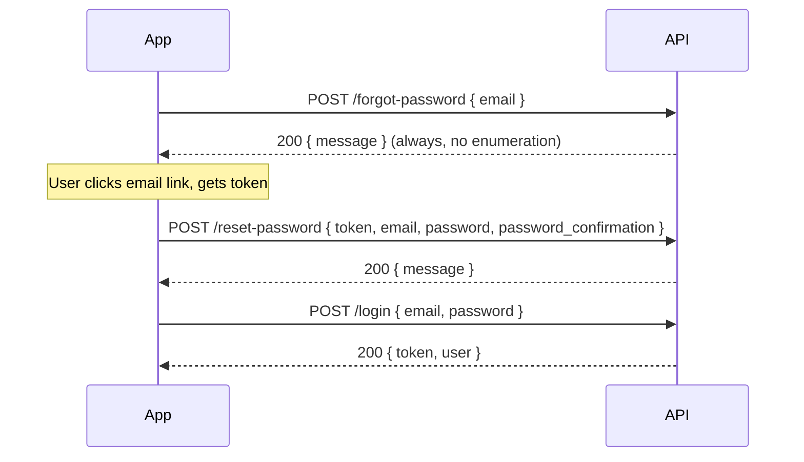
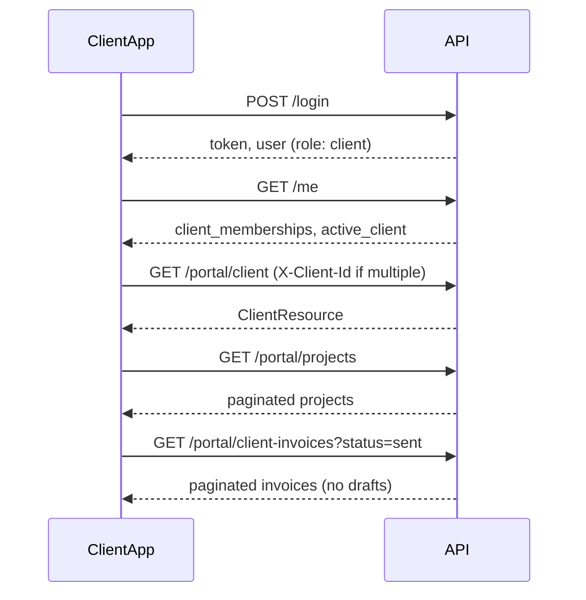
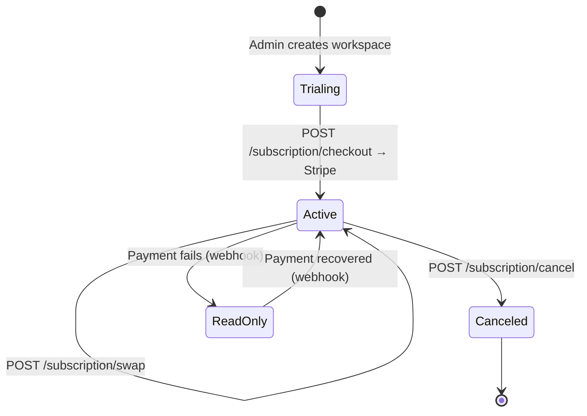

# API User Journey

Step-by-step guide for integrating with the LanceHive API (`/api/v1`). Use this document to understand **who calls what, in what order**, before diving into per-route specs in [endpoints/](./endpoints/).

**Related docs:** [conventions.md](./conventions.md) · [errors.md](./errors.md) · [README.md](./README.md) · Live OpenAPI at `/docs/api`

---

## Personas

| Persona | Role | Primary routes |
|---------|------|----------------|
| **Super admin** | Platform operator | `/admin/*` |
| **Workspace owner** | Freelancer who owns a workspace | Tenant routes + `/subscription/*` |
| **Workspace member** | Invited team member | Tenant routes (no subscription mutations) |
| **Client user** | External client contact | `/portal/*` |

---

## Request anatomy

Every protected request follows the same pattern:

```http
POST /api/v1/clients
Authorization: Bearer {token}
X-Freelancer-Id: {freelancer_id}
Content-Type: application/json
Accept: application/json
```

| Header | When required | Purpose |
|--------|---------------|---------|
| `Authorization: Bearer {token}` | All protected routes | Sanctum token from `POST /login` |
| `X-Freelancer-Id` | Tenant routes when user has multiple workspaces | Select active workspace |
| `X-Client-Id` | Portal routes when user has multiple client orgs | Select active client |

**Auto-selection:** If the user belongs to exactly one workspace (or one client org), the context header is optional on `GET /me` and tenant/portal routes.

---

## High-level flow

```mermaid
flowchart TD
    A[POST /login] --> B[GET /me]
    B --> C{Which persona?}

    C -->|Super admin| D[/admin/*]
    C -->|Freelancer| E[Set X-Freelancer-Id]
    C -->|Client user| F[Set X-Client-Id]

    E --> G[Workspace operations]
    G --> H[Clients → Projects → Tasks → Time logs]
    H --> I[Client invoices]
    G --> J[Members & settings]
    G --> K[Subscription]

    F --> L[/portal/*]
    L --> M[View projects & invoices]

    D --> N[Freelancers, plans, settings]
```

---

## Journey 1 — Authentication & session bootstrap

All personas start here.

### Step 1: Obtain a token

```http
POST /api/v1/login
Content-Type: application/json

{
  "email": "jane@example.com",
  "password": "secret"
}
```

**Response `200`:**

```json
{
  "token": "1|abc...",
  "user": {
    "id": 1,
    "name": "Jane Owner",
    "email": "jane@example.com",
    "role": "freelancer"
  }
}
```

Store `token` securely. Send it on every subsequent request.

### Step 2: Load profile & context

```http
GET /api/v1/me
Authorization: Bearer {token}
```

**Response includes:**

- `user` — authenticated profile
- `memberships` — workspaces the user belongs to
- `active_freelancer` — current workspace (auto-selected if only one)
- `subscription` — plan status, trial, read-only flag
- `client_memberships` / `active_client` — for portal users

### Step 3: Select workspace (multi-workspace users)

If `memberships` has more than one entry, pick a `freelancer_id` and send it on tenant routes:

```http
GET /api/v1/me
Authorization: Bearer {token}
X-Freelancer-Id: 42
```

Use the same header value for all workspace-scoped calls until the user switches workspace in your UI.

### Step 4: End session

```http
POST /api/v1/logout
Authorization: Bearer {token}
```

### Password recovery (optional)



See [endpoints/auth.md](./endpoints/auth.md) for field rules and error codes.

---

## Journey 2 — Super admin (platform setup)

Super admins provision workspaces and manage plans.

```mermaid
flowchart LR
    A[POST /login] --> B[GET /me]
    B --> C[POST /admin/freelancers]
    C --> D[Owner receives invite email]
    D --> E[Owner sets password via reset flow]
    B --> F[GET /admin/plans]
    F --> G[POST /admin/plans]
    B --> H[PATCH /admin/freelancers/{id}/subscription]
```

### Typical sequence

| Step | Endpoint | Purpose |
|------|----------|---------|
| 1 | `POST /login` | Authenticate as super admin |
| 2 | `GET /me` | Confirm `role: super_admin` |
| 3 | `GET /admin/plans` | List available plans |
| 4 | `POST /admin/plans` | Create a plan (if needed) |
| 5 | `POST /admin/freelancers` | Create workspace + owner + trialing subscription |
| 6 | `POST /admin/freelancers/{id}/resend-invite` | Resend invite if needed |
| 7 | `PATCH /admin/freelancers/{id}/subscription` | Override plan/status for custom deals |

**Example — create a workspace:**

```http
POST /api/v1/admin/freelancers
Authorization: Bearer {token}
Content-Type: application/json

{
  "name": "Acme Studio",
  "owner_name": "Jane Owner",
  "owner_email": "jane@acme.com",
  "plan_id": 1
}
```

No `X-Freelancer-Id` header — admin routes are platform-scoped.

See [endpoints/admin-freelancers.md](./endpoints/admin-freelancers.md) and [endpoints/admin-plans.md](./endpoints/admin-plans.md).

---

## Journey 3 — Freelancer workspace (core product loop)

The main day-to-day flow: manage clients, track work, bill time.

```mermaid
flowchart TD
    subgraph Setup
        A[POST /login] --> B[GET /me]
        B --> C[X-Freelancer-Id on all tenant calls]
    end

    subgraph Team
        C --> D[POST /members]
        C --> E[GET /members]
    end

    subgraph Delivery
        C --> F[POST /clients]
        F --> G[POST /clients/{id}/projects]
        G --> H[POST /projects/{id}/tasks]
        H --> I[POST /tasks/{id}/time-logs]
        I --> J[GET /projects/{id}/time-summary]
    end

    subgraph Billing
        J --> K[POST /projects/{id}/client-invoices]
        K --> L[POST /client-invoices/{id}/items]
        L --> M[PATCH /client-invoices/{id} status → sent]
        M --> N[POST /client-invoices/{id}/payments]
    end

    subgraph Client access
        F --> O[POST /clients/{id}/members]
        O --> P[Client user logs in → /portal/*]
    end
```

### Phase A — Workspace setup

| Step | Endpoint | Notes |
|------|----------|-------|
| 1 | `POST /login` | Owner or member credentials |
| 2 | `GET /me` | Read `active_freelancer.id` and `subscription.read_only` |
| 3 | `PATCH /me/settings` | Timezone, locale (optional) |
| 4 | `GET /workspace/settings` | Read workspace defaults |
| 5 | `PATCH /workspace/settings` | Owner/admin only |
| 6 | `POST /members` | Invite team (`admin` or `member` role) |

### Phase B — Client & project hierarchy

Resources nest: **Client → Project → Task → Time log**.

| Step | Endpoint | Creates |
|------|----------|---------|
| 1 | `POST /clients` | Client record |
| 2 | `POST /clients/{client}/projects` | Project under client |
| 3 | `POST /projects/{project}/tasks` | Task under project |
| 4 | `POST /tasks/{task}/time-logs` | Billable time entry |

**Example — log time:**

```http
POST /api/v1/tasks/15/time-logs
Authorization: Bearer {token}
X-Freelancer-Id: 42
Content-Type: application/json

{
  "hours": "2.50",
  "description": "Homepage wireframes",
  "logged_at": "2026-03-10T14:00:00+00:00"
}
```

**List shortcuts:**

| Need | Endpoint |
|------|----------|
| All clients | `GET /clients` |
| All projects (cross-client) | `GET /projects` |
| Client's projects | `GET /clients/{client}/projects` |
| Project tasks | `GET /projects/{project}/tasks` |
| Task time logs | `GET /tasks/{task}/time-logs` |
| Unbilled hours summary | `GET /projects/{id}/time-summary` |

### Phase C — Invoicing

| Step | Endpoint | Purpose |
|------|----------|---------|
| 1 | `POST /projects/{project}/client-invoices` | Create draft (optionally `prefill_unbilled_time: true`) |
| 2 | `GET /client-invoices/{id}` | Review items, balance |
| 3 | `POST /client-invoices/{id}/items` | Add manual line items |
| 4 | `PATCH /client-invoices/{id}` | Update due date, notes, or transition status |
| 5 | `POST /client-invoices/{id}/payments` | Record payment |
| 6 | `DELETE /client-invoices/{id}` | Void draft only |

Draft invoices can be edited; sent invoices follow status rules in [endpoints/client-invoices.md](./endpoints/client-invoices.md).

### Phase D — Invite client contacts

| Step | Endpoint | Purpose |
|------|----------|---------|
| 1 | `POST /clients/{client}/members` | Invite client user to portal |
| 2 | Client logs in | Same `POST /login` |
| 3 | Client calls portal | See Journey 4 |

---

## Journey 4 — Client portal (read-only)

Client users see their organization's projects and invoices — no write access.



| Step | Endpoint | Returns |
|------|----------|---------|
| 1 | `POST /login` | Token |
| 2 | `GET /me` | `client_memberships`, `active_client` |
| 3 | `GET /portal/client` | Active client profile |
| 4 | `GET /portal/projects` | Projects for that client |
| 5 | `GET /portal/client-invoices` | Sent/paid/overdue invoices |

Send `X-Client-Id` when the user belongs to multiple client organizations.

See [endpoints/portal.md](./endpoints/portal.md).

---

## Journey 5 — Subscription & billing

Workspace owners manage Stripe subscriptions. These routes **always allow writes**, even when the workspace is read-only.



| Step | Endpoint | Purpose |
|------|----------|---------|
| 1 | `GET /me` | Check `subscription.status` and `read_only` |
| 2 | `GET /subscription` | Full subscription detail (owner only) |
| 3 | `POST /subscription/checkout` | Get Stripe checkout URL |
| 4 | User completes Stripe checkout | Browser redirect |
| 5 | Stripe → `POST /webhooks/stripe` | Server updates subscription (not your app) |
| 6 | `GET /me` or `GET /subscription` | Confirm `status: active` |

**Read-only mode:** When `subscription.read_only` is `true`, tenant **write** routes return `403 workspace_read_only`. Reads still work. Subscription mutations and admin routes are exempt.

See [endpoints/subscription.md](./endpoints/subscription.md) and [endpoints/webhooks.md](./endpoints/webhooks.md).

---

## Pagination pattern (all list endpoints)

Every list uses **cursor pagination**:

```http
GET /api/v1/clients?per_page=25
Authorization: Bearer {token}
X-Freelancer-Id: 42
```

**Response shape:**

```json
{
  "data": [ /* ... */ ],
  "links": { "first": "...", "prev": null, "next": "..." },
  "meta": { "per_page": 25, "next_cursor": "eyJpZCI6MjV9", "prev_cursor": null }
}
```

**Next page:**

```http
GET /api/v1/clients?per_page=25&cursor=eyJpZCI6MjV9
```

| Rule | Value |
|------|-------|
| Default `per_page` | 25 |
| Max `per_page` | 100 |
| Invalid `per_page` | `422 validation_failed` |

See [schemas/pagination.md](./schemas/pagination.md).

---

## Error handling cheat sheet

All errors return JSON. Business errors include a machine-readable `code`.

| HTTP | code | Typical cause | Action |
|------|------|---------------|--------|
| 401 | `unauthenticated` | Missing/expired token | Re-login |
| 403 | `forbidden` | Wrong role or not a member | Check policy / membership |
| 403 | `workspace_read_only` | Subscription lapsed | Prompt owner to renew |
| 403 | `super_admin_required` | Non-admin on `/admin/*` | Use correct account |
| 404 | `not_found` | Resource missing or cross-tenant | Don't retry; verify IDs |
| 422 | `validation_failed` | Bad input | Fix request body |
| 422 | `plan_limit_exceeded` | Plan cap hit | Upgrade plan |
| 429 | `too_many_requests` | Rate limited | Back off and retry |

Validation errors (`422`) use Laravel's `errors` object (field → messages) without a top-level `code`.

Full catalog: [errors.md](./errors.md).

---

## Complete step-by-step reference (freelancer MVP)

Use this checklist when building a client app from scratch:

```
1.  POST /login                              → store token
2.  GET  /me                                 → workspace list, subscription state
3.  GET  /me/settings                        → user preferences
4.  PATCH /me/settings                       → set timezone (optional)
5.  GET  /workspace/settings                 → workspace config
6.  POST /members                            → invite team (optional)
7.  POST /clients                             → create first client
8.  POST /clients/{id}/projects              → create project
9.  POST /projects/{id}/tasks                → create task
10. POST /tasks/{id}/time-logs                → log hours
11. GET  /projects/{id}/time-summary          → review unbilled time
12. POST /projects/{id}/client-invoices       → draft invoice
13. PATCH /client-invoices/{id}               → mark sent
14. POST /client-invoices/{id}/payments       → record payment
15. POST /clients/{id}/members                → invite client to portal
16. POST /logout                              → end session
```

For subscription setup (owner), insert between steps 2 and 3:

```
2b. GET  /subscription
2c. POST /subscription/checkout               → redirect to checkout_url
2d. GET  /me                                  → confirm active subscription
```

---

## Route group quick reference

| Prefix | Auth | Context header | Writes when lapsed? |
|--------|------|----------------|---------------------|
| `/login`, `/forgot-password`, `/reset-password` | None | — | N/A |
| `/me`, `/me/settings` | Bearer | Optional | Yes |
| `/admin/*` | Bearer + super admin | — | Yes |
| `/clients`, `/projects`, `/tasks`, `/time-logs`, `/members`, … | Bearer | `X-Freelancer-Id` | Reads: yes · Writes: blocked |
| `/subscription/*` | Bearer + owner | `X-Freelancer-Id` | Yes (always) |
| `/portal/*` | Bearer | `X-Client-Id` | Read-only |
| `/webhooks/stripe` | Stripe signature | — | N/A |

---

## Interactive exploration

| Tool | URL | Use for |
|------|-----|---------|
| Stoplight UI | `/docs/api` | Browse & try endpoints |
| OpenAPI JSON | `/docs/api.json` | Code generation, CI contract tests |
| Per-route specs | [endpoints/](./endpoints/) | Request/response field detail |
| JSON schemas | [schemas/](./schemas/) | Resource field reference |

---

## Next steps

1. Read [conventions.md](./conventions.md) for global rules (data types, soft deletes, cross-tenant 404s).
2. Pick your persona journey above and follow the linked endpoint files.
3. Use `/docs/api` to inspect live schemas generated from code.
